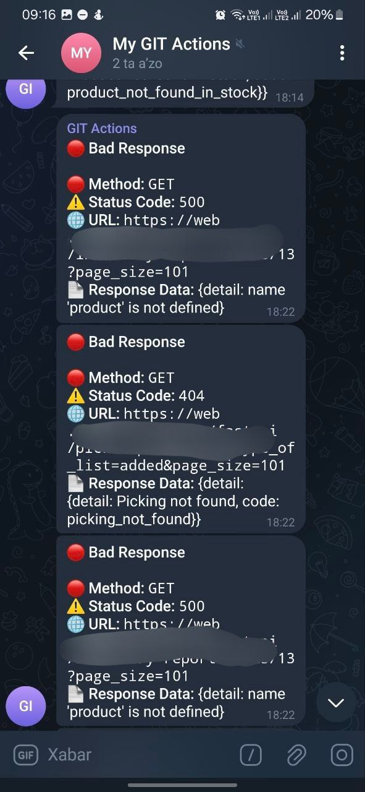

# Telegram Bot Crashlytics

Telegram Bot Crashlytics is a package that works with the `Dio` library to send application errors directly to Telegram. With this package, you can send errors from your app to your Telegram group or channel in real-time.


## Features
- Automatic error reporting to Telegram.
- Monitors any HTTP errors via a `Dio` interceptor.
- Allows sending additional messages (for example, user notifications or system status updates).

## Installation

Add the following line to your `pubspec.yaml` file:

```yaml
dependencies:
  telegram_bot_crashlytics: ^1.0.0
```

Or, install it via the command line:

```bash
flutter pub add telegram_bot_crashlytics
```

## Usage

### 1. Creating a Bot

To create a new bot in Telegram, contact `BotFather` and obtain the bot token.

 

### 2. Obtaining the Telegram Chat ID

Identify the `Chat ID` of the group or channel where you want to receive messages. You can find this by sending a message to yourself or the bot and then accessing it through the API: `https://api.telegram.org/bot<your-bot-token>/getUpdates`.

### 3. Verifying the Result from Chat

After sending a test message, you should see a response similar to the following:



### 4. Setting up Telegram Bot Crashlytics

Configure the package in your app as follows:

```dart
import 'package:telegram_bot_crashlytics/telegram_bot_crashlytics.dart';

void main() {
  // Set up Telegram Bot Crashlytics
  final telegramCrashlytics = TelegramBotCrashlytics(
    botToken: 'YOUR_BOT_TOKEN',
    chatId: YOUR_CHAT_ID,
  );

  // Set up Dio and add the interceptor
  final dio = Dio();
  dio.interceptors.add(telegramCrashlytics.interceptor);
}
```

### 5. Monitoring Errors

When making HTTP requests with `Dio`, errors are automatically sent to Telegram via the interceptor.

If you want to manually send a message outside of Dio errors:

```dart
await telegramCrashlytics.sendErrorToTelegram("Describe the error here.");
await telegramCrashlytics.sendInfoToTelegram("Provide additional information here.");
```

## Additional Settings

You can use the `sendErrorToTelegram` and `sendInfoToTelegram` methods to send custom messages.


## Example Usage

```dart
// Executing HTTP request with Dio
final response = await dio.get('https://jsonplaceholder.typicode.com/posts');

// If an error occurs, it will be automatically sent to Telegram by the interceptor.
```

## Join Our Channel

Join our Telegram channel for updates and Flutter tips: [@FlutterMarkazi](https://t.me/FlutterMarkazi)
